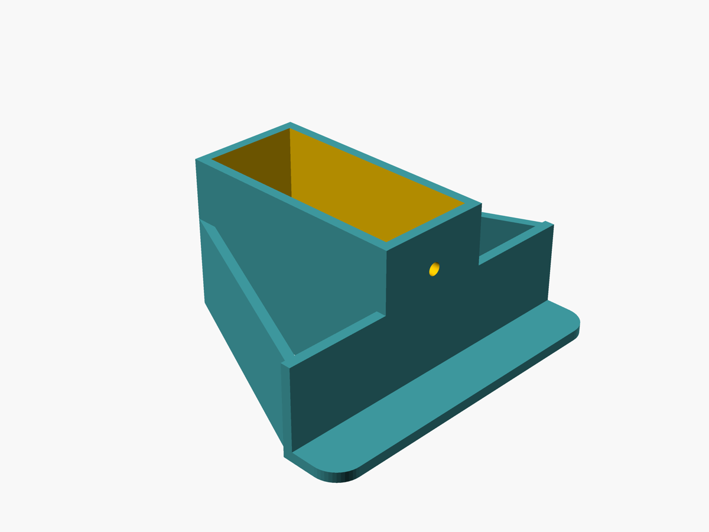
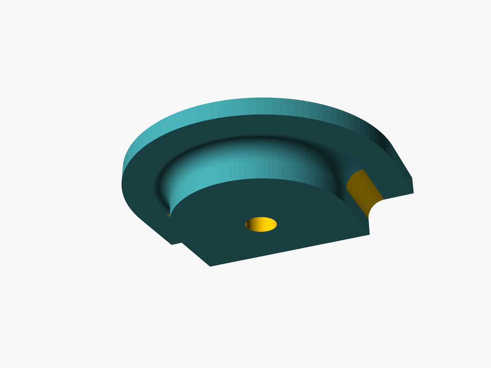

# Držáky dřevěného profilu pro vestavbu kempovací poličky do automobilu

3D tisknutelné držáky pro upevnění dřevěného profilu, na který se připevní polička.
Držáky jsou navrženy pro snadné nasazení a zajištění proti vysunutí, přičemž využívají existující otvory a oka v zavazadlovém prostoru automobilu.

Pro vůz: Citroen C4 Grand Picasso 2. gen (od 2013)
Jazyk zdrojových dat 3D modelu: OpenSCAD

Rozměry a odvozené hodnoty jsou parametry na začátku každého `.scad` souboru. Sem patří jen účel a záměry, které z kódu nejsou na první pohled zřejmé.

## Přední držák

Soubor: `vestavba-drzak-predni.scad`

Účel: nasouvací držák na vodorovný dřevěný profil (vyšší stranou nahoru). Jazýček zapadne do vodorovného úzkém otvoru v automobilu (kterým se vysouvá bezpečnostní pás) a zajistí profil proti vysunutí.

Potřebný dřevěný trám: profil **19 × 43 mm** (užší strana 19 mm, vyšší strana 43 mm nahoru).

Hlavní prvky a záměry:
- Průchozí obdélníkový tunel, otevřený na obou koncích (profil jím prochází).
- Jazýček (háček) na horní straně míří ven od těla a dolů do otvoru. Zaoblený je jen na svých dvou vnějších hranách, strana u těla zůstává ostrá.
- Horní základna rozšiřuje horní plochu do stran a drží profil na středu (proti překlápění). Je zapuštěná do horní stěny tunelu, aby nahoře nevznikala dvojitá tloušťka materiálu.
- Boční výztuhy: jen jedna šikmá deska na každé straně (úhlopříčka od hrany základny k patě tunelu), jejíž vnější hrana lícuje se základnou a nepřečnívá. Záměrně žádný plný ani dutý trojúhelník a žádné členy podél základny či tunelu.
- Volitelný otvor na šroubek skrz horní stěnu tunelu.

`is_poc = true` přepíná na mělčí zkušební variantu (pro rychlejší vytištění).

## Zadní díl - přítlačná podložka

*Pohled zespodu – na spodní (dosedací) straně je vidět konkávní lůžko (drážka) kopírující prut oka ve tvaru „U".*

Soubor: `vestavba-drzak-zadni.scad`

Princip: Zadní trám leží na okách umístěných na bočních stěnách zavazadlového prostoru. Oka se otočí do vodorovné polohy. Přítlačná podložka se položí na oko a zajistí se šroubkem, který ji přitahuje dolů. Tím přitlačuje oko k trámu a zároveň brání posunutí oka po trámu. Jde tedy o tvarovanou podložku usazenou na oku, jejímž úkolem je oko zafixovat – přitlačit i zaaretovat.

Hlavní prvky a záměry:
- Tvar kopíruje oko ve tvaru „U" (půlkruh + dvě rovné nohy): podložka je z jedné strany kulatá, zbytek rovný.
- Tělo je zespodu tlustý blok se svislou stěnou, nahoře tenký širší lem.
- Lůžko pro prut oka je na spodní straně zaobleno.
- Průchozí otvor pro šroub ve středu, bez zapuštění (kvůli pevnosti).

